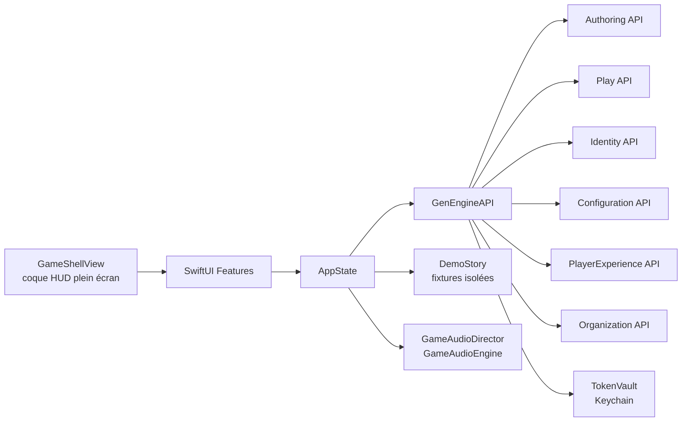

# Architecture

## Décision

GenEngine iOS est un client SwiftUI natif et autonome. Il présente les projections calculées par GenEngine et envoie les intentions utilisateur ; il n'embarque pas le moteur narratif.

## Frontières

- `App` assemble la coque HUD, les destinations et l'état produit.
- `Features` porte les parcours utilisateur sans dépendance réseau directe.
- `Core/Networking` traduit les contrats HTTP en modèles client.
- `Core/Security` possède le stockage des credentials.
- `Core/Configuration` possède les endpoints et préférences non sensibles.
- `Core/Audio` pilote trois couches sonores derrière le protocole `GameAudioEngine`, sans nom de fichier codé en dur.
- `Core/DesignSystem` porte les tokens et les composants du HUD.
- `DemoStory` fournit un parcours hors ligne explicite et ne sert jamais de fallback silencieux.

## Présentation plein écran

`GameShellView` remplace le `TabView` et le `NavigationStack` racine. La destination courante est rendue bord à bord et le HUD flotte au-dessus sans réserver de place : navigation en barre basse en largeur compacte, en rail vertical gauche en largeur régulière, menus en panneaux superposés, partie en `fullScreenCover`. Le contenu défilant dégage sa zone par `safeAreaPadding`.

`AppState.destinations` calcule les destinations selon l'authentification puis les permissions, et `AppState.activeTab` ramène la sélection dans cette liste. Masquer une destination est une commodité de présentation : l'autorisation reste appliquée par le service propriétaire.

## Contrats backend

Identity authentifie, Authoring publie et expose le catalogue, Play exécute les sessions et publie la topologie des versions publiées, Configuration porte les paramètres et le dictionnaire de copies, PlayerExperience porte le bootstrap joueur, Organization porte unités, périodes et affectations.

Deux contrats de graphe coexistent et ne sont jamais confondus : `NarrativeTree` (`GET /sessions/{id}/tree`) porte les états de scène et l'évaluation des conditions d'une partie ; `ScenarioStructure` (`GET /scenario-versions/{id}/tree`) ne porte que la topologie, faute d'état de monde hors session. `QuestGraphPresentation` les adapte vers une projection de présentation unique plutôt que de prêter des états à celui qui n'en publie pas.

Le client ne lit aucune base et ne partage aucun modèle de domaine interne avec ces services. Toute évolution incompatible d'un contrat doit produire une erreur explicite, une migration client ou une stratégie de compatibilité documentée.

Le client appelle les six services directement. Un point d'entrée public unique reste recommandé avant distribution.

## Accessibilité et plateformes

Le déploiement cible iOS 17+, iPhone et iPad. Les composants préservent Dynamic Type, VoiceOver, les contrastes, Reduce Motion et les cibles tactiles minimales de 44 points. Chaque état du HUD est porté par un symbole et un texte, jamais par la couleur seule. La direction visuelle emploie ink, ivory, ember et verdigris sans compromettre ces exigences.

Ces exigences sont tenues par construction dans le code ; elles n'ont pas été vérifiées à l'écran pour la coque HUD, jamais lancée en simulateur ni sur appareil. Voir [`handoff.md`](handoff.md).
