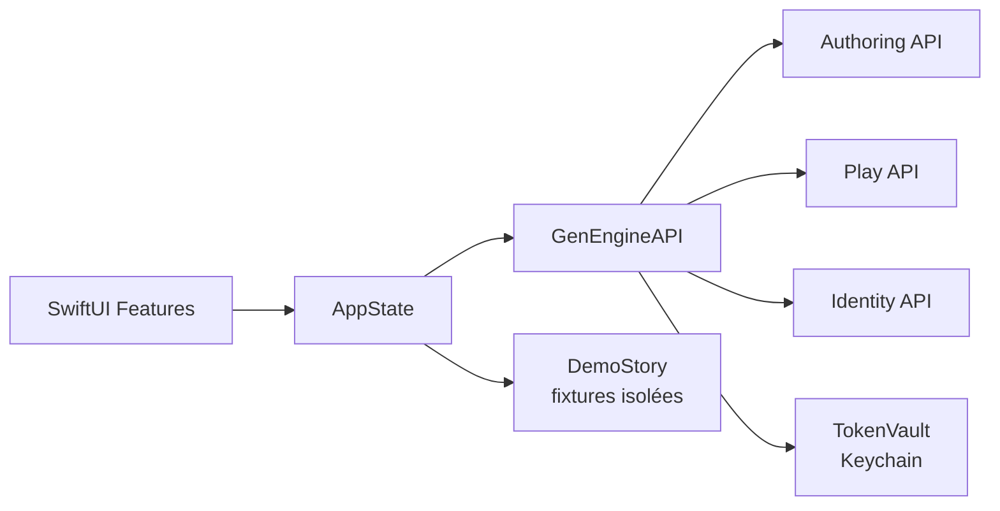

# Architecture

## Décision

GenEngine iOS est un client SwiftUI natif et autonome. Il présente les projections calculées par GenEngine et envoie les intentions utilisateur ; il n’embarque pas le moteur narratif.

## Frontières

- `App` assemble la navigation et l’état produit.
- `Features` porte les parcours utilisateur sans dépendance réseau directe.
- `Core/Networking` traduit les contrats HTTP en modèles client.
- `Core/Security` possède le stockage des credentials.
- `Core/Configuration` possède les endpoints et préférences non sensibles.
- `DemoStory` fournit un parcours hors ligne explicite et ne sert jamais de fallback silencieux.

## Contrats backend

Identity authentifie, Authoring publie et expose le catalogue, Play exécute les sessions et publie la topologie des versions publiées. Deux contrats de graphe coexistent et ne sont jamais confondus : `NarrativeTree` (`GET /sessions/{id}/tree`) porte les états de scène et l'évaluation des conditions d'une partie ; `ScenarioStructure` (`GET /scenario-versions/{id}/tree`) ne porte que la topologie, faute d'état de monde hors session. Le client les adapte vers une projection de présentation unique plutôt que de prêter des états à celui qui n'en publie pas. Le client ne lit aucune base et ne partage aucun modèle de domaine interne avec ces services. Toute évolution incompatible d’un contrat doit produire une erreur explicite, une migration client ou une stratégie de compatibilité documentée.

## Accessibilité et plateformes

Le déploiement cible iOS 17+, iPhone et iPad. Les composants préservent Dynamic Type, VoiceOver, les contrastes, Reduce Motion et les cibles tactiles minimales. La direction visuelle emploie ink, ivory, ember et verdigris sans compromettre ces exigences.
